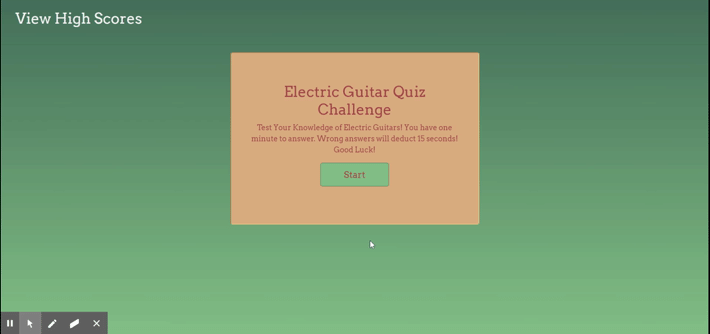

# Timed-Quiz

## Description

For this assignment I created a timed quiz about my favorite topic: Electric Guitars. The quiz's contents have nothing to do with computer science, but creating the quiz was an excercise in putting Javascript Concepts into practice. The quiz is multiple choice, records user answers as correct or incorrect, and allows the user to submit their high score to a leaderboard stored on the user's local memory. Incorrect choices will subtract time from the timer, causing the quiz to end with a score of zero if time runs out.

### Application Link
[https://acruhf.github.io/Timed-Quiz/] 
[https://github.com/acruhf/Timed-Quiz]

### Preview

#### Credits
This project was made with some collaboration from Amanda Wiehrs.
